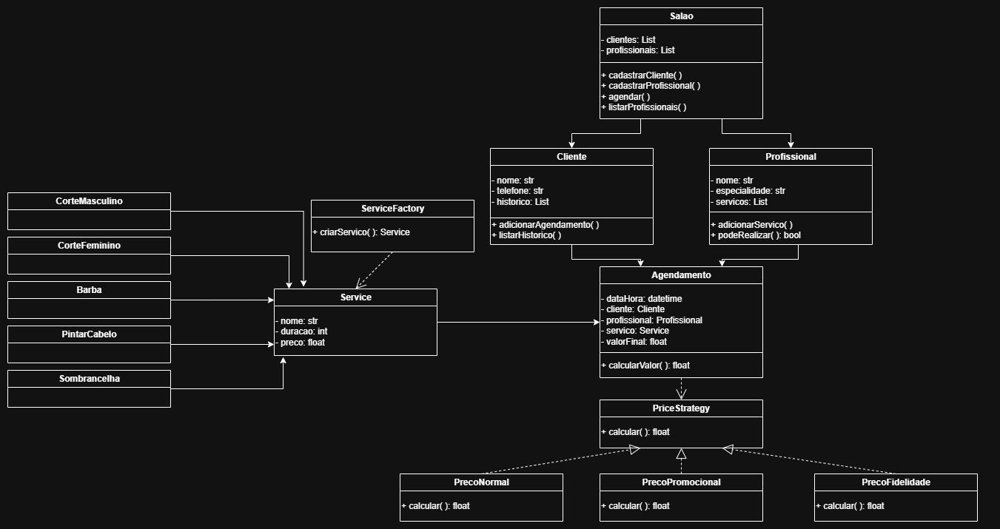

# 💈 Sistema de Gerenciamento de Salão de Beleza  
**Tecnologia Orientada a Objetos — Avaliação Prática Final**

---

## 📘 Descrição do Tema

Este projeto consiste no desenvolvimento de um sistema orientado a objetos para gerenciamento de um **salão de beleza**, permitindo gerenciar:

- Clientes  
- Profissionais  
- Serviços oferecidos  
- Agendamentos  
- Cálculo de preço com estratégias diferentes  
- Histórico de atendimentos  

O sistema foi implementado em Python, aplicando todos os pilares da POO e dois padrões de projeto: **Factory** e **Strategy**.

---

## 🎯 Objetivo do Projeto

O objetivo é construir uma aplicação modular, extensível e coerente com os princípios da Programação Orientada a Objetos. O sistema demonstra:

- Aplicação dos pilares da POO  
- Uso prático de padrões de projeto  
- Modelagem UML completa  
- Estrutura clara e apropriada para evolução  

---

# 🧩 Diagrama de Classes UML

---

# 🏛️ Descrição das Classes e Pilares da POO

A seguir estão as classes do sistema e os pilares aplicados em cada uma.

---

## 📍 Salao

Gerencia todo o sistema.

### **Atributos**
- clientes  
- profissionais  

### **Métodos**
- cadastrarCliente()  
- cadastrarProfissional()  
- agendar()  

### **Pilares da POO**
- **Abstração:** representa o conceito de um salão.  
- **Encapsulamento:** mantém controle das listas de clientes e profissionais.  
- **Polimorfismo:** usa estratégias de preço de forma genérica.  

---

## 📍 Cliente

Representa um cliente do salão.

### **Atributos**
- nome  
- telefone  
- historico  

### **Métodos**
- adicionarAgendamento()  
- listarHistorico()  

### **Pilares da POO**
- **Encapsulamento:** controla o histórico apenas por métodos próprios.  
- **Abstração:** modela um cliente do mundo real.  

---

## 📍 Profissional

Representa profissionais do salão.

### **Atributos**
- nome  
- especialidade  
- servicos  

### **Métodos**
- adicionarServico()  
- podeRealizar()  

### **Pilares da POO**
- **Encapsulamento:** gerencia serviços internamente.  
- **Abstração:** representa um profissional real.  

---

## 📍 Service

Representa um serviço do salão.

### **Atributos**
- nome  
- duracao  
- preco  

### **Pilares da POO**
- **Abstração:** representa um serviço real de forma clara.  

---

## 📍 ServiceFactory (Factory Pattern)

Responsável por criar serviços.

### **Métodos**
- criarServico()

### **Pilares da POO**
- **Abstração:** isola a criação dos serviços.  
- **Polimorfismo:** pode gerar serviços diferentes futuramente.  

---

## 📍 Agendamento

Conecta cliente, profissional e serviço.

### **Atributos**
- dataHora  
- cliente  
- profissional  
- servico  
- valorFinal  

### **Métodos**
- calcularValor()  

### **Pilares da POO**
- **Encapsulamento:** controla o valor calculado internamente.  
- **Abstração:** representa um agendamento real.  

---

## 📍 PriceStrategy (Strategy Pattern)

Define a interface para cálculo de preços.

### **Método**
- calcular()

### **Subclasses**
- PrecoNormal  
- PrecoPromocional  
- PrecoFidelidade  

### **Pilares da POO**
- **Herança:** subclasses derivam da interface PriceStrategy.  
- **Polimorfismo:** cada estratégia implementa seu próprio cálculo.  
- **Encapsulamento:** cada classe guarda sua lógica de preço.  

---

# 🧠 Padrões de Projeto Aplicados

---

## 🏭 Factory — *ServiceFactory*

O padrão Factory centraliza a criação de objetos Service, permitindo:

- Padronização  
- Manutenção facilitada  
- Extensibilidade  
- Redução de acoplamento  

---

## 🎚️ Strategy — *PriceStrategy*

O padrão Strategy permite alternar dinamicamente entre diferentes formas de cálculo de preço.

**Estratégias implementadas:**

- Preço normal  
- Preço promocional  
- Preço fidelidade  

**Benefícios:**

- Evita if/else extensos  
- Facilita adicionar novas regras  
- Mantém o código limpo e modular  

---